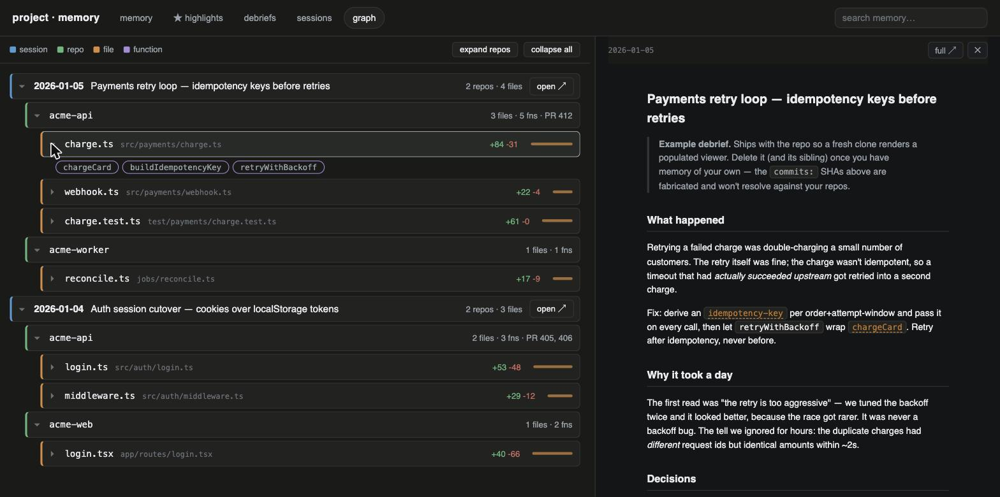

# claude-debrief

Auto-drafted, human-curated project memory for Claude Code sessions — plus a
`session → repo → file → function` graph of what each session actually touched,
derived from git.

A `SessionEnd` hook fires when a Claude Code session exits, queues the session,
and spawns a detached headless `claude -p` that drafts a note on what happened.
Drafts are **staging material**: nothing reaches durable memory without a human
pass.

Four pieces, all dependency-light (bash + python3 stdlib + node):

- **Capture** — SessionEnd hook, durable queue receipt, detached drafter,
  self-repair sweep for drafters that die
- **Curation gate** — `/debrief` and `/debrief day` slash commands; machine
  drafts become durable memory only through a reviewed daily
- **Retrieval** — `debrief-search.py`, sqlite FTS5 over *curated content only*,
  search → get progressive disclosure
- **Provenance graph** — git-derived `session → repo → file → function`
  drill-down, rendered by a small Vite/React viewer



---

## The problem this solves

Two failure modes, pulling opposite directions:

- **Sessions that end without a debrief are lost.** The reasoning — why the
  obvious fix didn't work, what you ruled out — evaporates. Git keeps the
  outcome, never the argument.
- **Auto-capture records wrong conclusions as confidently as right ones.** A
  transcript summarizer can't tell "we verified this" from "we said this and
  stopped". Memory that lies is worse than no memory, because you *trust* it.

**Resolution: auto-draft at session end, curate at day level.** Capture is
automatic so nothing is lost. Promotion is manual so nothing is laundered. The
gate between them is the entire design.

> If you take one idea from this repo, take that. The hook and the viewer are
> implementation; the gate is the point.

## Why not CLAUDE.md, mem0, or Basic Memory?

Those tools store memory; none of them gate it.

- **CLAUDE.md and auto-memory files** hold standing instructions, loaded into
  every session whole. There is no episodic record, no provenance, and no way
  to tell a verified conclusion from a confident guess that got written down.
- **Automatic memory layers** (mem0-style) extract "facts" from conversations
  and index them immediately — exactly the failure mode above: wrong
  conclusions recorded as confidently as right ones, then served back with
  authority.
- **Notes-first tools** (Basic Memory–style) get the human-written part right
  but capture nothing on their own; a session that ends without a note is
  simply gone.

claude-debrief is the combination: capture is automatic so nothing is lost,
promotion is human so nothing is laundered, and retrieval indexes only what
survived the gate. If you already use one of the tools above, the curation
gate is the part you're missing — not the storage.

## Four layers

| Layer | What | Mutability |
|---|---|---|
| **Episodic** | Daily debriefs (`YYYY-MM-DD-<slug>.md`) and per-session notes (`sessions/`) | Immutable once written |
| **Semantic** | `INDEX.md` — table + `[[entity]]` glossary + principles | Pruned and **rewired** toward current understanding |
| **Starred** | `HIGHLIGHTS.md` — `★` must-know-forever entries | Append-only; **never pruned** |
| **Todo** | `TODO.md` — open threads a human chose to track until resolved | Items open and close; closed items pruned once their closing daily records the outcome |

Episodic files say what was believed at the time, and stay wrong on purpose.
Corrections happen in the semantic layer, by rewiring — never by editing history.

The starred layer exists because `INDEX.md` answers "what is true *now*" — an
entry that stops being load-bearing gets rewired away, which is the wrong
behavior for a lesson you paid for once and must never relearn. `HIGHLIGHTS.md`
holds rare, append-only `★` entries that only a **human** stars (agents may
propose `★ (candidate)`, never promote), with no recurrence bar — the 3am root
cause qualifies on first occurrence. Rationale and format:
[docs/starred-layer.md](docs/starred-layer.md).

The todo layer exists because episodic files are immutable and read by date:
every draft and daily records **Open threads**, but a thread opened Tuesday is
invisible by Friday unless someone rereads Tuesday. `TODO.md` holds the ones a
human chose to track, visible until resolved — same gate as everything else
(`/debrief day` proposes candidates and closures, a person approves;
`/debrief-todos add`/`done` is the immediate human-authored path). Admit only
what would otherwise be lost — if the list outgrows a screen, the bar was too
low. Rationale: [docs/todo-layer.md](docs/todo-layer.md).

## Lifecycle

```
session ends ──SessionEnd hook──▶ .system/session-debrief.sh
                                    ├─ appends sessions/queue.jsonl   (durable receipt)
                                    └─ spawns headless `claude -p`    (detached)
                                         └─▶ sessions/<date>/<HHMM>-<sid>.md   status: machine-draft

/debrief       (optional, in-session) ─▶ sessions/<date>/<HHMM>-<slug>.md      status: curated
/debrief day   (end of day, manual)   ─▶ synthesize <date>-<slug>.md  ─▶ review with the human
                                       ─▶ update INDEX.md  ─▶ offer ★ + todo candidates  ─▶ archive drafts

/debrief highlight <thing>  (human, any time) ─▶ appends ★ entry to HIGHLIGHTS.md   (never pruned)
/debrief-todos [add|done]   (human, any time) ─▶ shows / updates TODO.md open-threads tracker

session starts ──SessionStart hook──▶ .system/backlog-nudge.sh
                                        └─ once/day, if the queue is non-empty: nudges the human to
                                           run /debrief day — read-only, never drains the backlog itself
```

The queue receipt is written **before** the drafter runs, so a drafter that dies
still leaves a record — and day mode can fall back to the raw transcript.

Capture is automatic and draining is manual, so a backlog of uncurated drafts
is the expected steady state, not a bug. The SessionStart nudge and the
`/debrief-backlog` command exist to keep that backlog in front of the human;
neither ever writes a daily — surfacing is not curation.

## Install

Copy this repo's contents into your project as `debrief/`:

```bash
git clone https://github.com/gurul/claude-debrief.git
mkdir -p /path/to/your-repo/debrief
cp -R claude-debrief/{.system,viewer,INDEX.md,HIGHLIGHTS.md,TODO.md,README.md} /path/to/your-repo/debrief/
cp claude-debrief/commands/*.md ~/.claude/commands/    # /debrief + /debrief-search + /debrief-backlog + /debrief-highlights + /debrief-todos
```

The layout is load-bearing: the machinery resolves paths relative to `debrief/`
(`..` is your repo root), so it must live at `<your-repo>/debrief/`.

**1. Gitignore your memory.** In your repo's `.gitignore`:

```
debrief/
```

Memory is personal and unreviewed. It should never land in a PR.

**2. Wire the hook** in `.claude/settings.local.json` (project-local, not a
shared `settings.json`):

```jsonc
{
  "hooks": {
    "SessionEnd": [
      {
        "hooks": [
          {
            "type": "command",
            "command": "$CLAUDE_PROJECT_DIR/debrief/.system/session-debrief.sh",
            "async": true
          }
        ]
      }
    ]
  }
}
```

`async: true` matters — `SessionEnd` is non-blocking, and you don't want a
drafter delaying session exit.

**3. Wire the backlog nudge** in the same `.claude/settings.local.json`. This
is what closes the loop: on a fresh session start it surfaces any uncurated
backlog into the conversation, so the pile can't grow unseen:

```jsonc
{
  "hooks": {
    "SessionStart": [
      {
        "matcher": "startup",
        "hooks": [
          {
            "type": "command",
            "command": "$CLAUDE_PROJECT_DIR/debrief/.system/backlog-nudge.sh",
            "timeout": 5
          }
        ]
      }
    ]
  }
}
```

`matcher: "startup"` restricts it to fresh launches (not resume/compact/clear).
**Not** `async` — an async `SessionStart` hook cannot contribute context, which
is the opposite of the SessionEnd drafter. It nudges at most once per day and
stays silent on a clean queue.

**4. Seed the memory.** Keep `INDEX.md` and `TODO.md` (edit the templates for
your project) and delete the two example dailies plus `provenance.json` once
you have real notes.

**5. Configure the graph** (optional):

```bash
cp debrief/.system/repos.example.json debrief/.system/repos.json  # then edit
```

**6. Enable the verbatim archive** (optional): add
`"env": { "DEBRIEF_RAW_ARCHIVE": "1" }` to the SessionEnd hook entry to keep
redacted, gzipped transcripts past Claude Code's ~30-day deletion — see
[docs/verbatim-archive.md](docs/verbatim-archive.md) before turning it on.

## Viewer

```bash
cd debrief/viewer
npm install
npm run dev        # http://localhost:5199
```

Vite + React. The graph tab is a vertically stacked drill-down tree —
session → repo → file → function, newest first, spread open on first load —
not a force simulation: dates read top-to-bottom and every level is a block
you click into. Markdown is pulled in via `import.meta.glob` at dev time, so
editing a note hot-reloads the graph. A fresh clone renders the shipped example
fixture; point `repos.json` at real repos and it renders yours. A **verbatim**
tab reads the cold-storage archive on explicit click, without ever indexing it.

## Going deeper

The design write-ups live in [`docs/`](docs/):

- **[Provenance graph](docs/provenance.md)** — declare commits in debrief
  frontmatter (`commits:` / `touched:`, SHAs and `a..b` ranges); the builder
  verifies every SHA against git before it becomes a node.
- **[Search](docs/search.md)** — two-step `search` → `get` retrieval, the
  curation-aware ranking, and why `★` hits are a sort key rather than a weight.
- **[Verbatim archive](docs/verbatim-archive.md)** — why summaries aren't
  enough for sessions you didn't watch, the fail-closed redactor, retention,
  and why the archive is never indexed.
- **[Reliability](docs/reliability.md)** — the self-repair sweep, the
  `pending → unconsumed → aggregated / failed` queue lifecycle, and backlog
  surfacing.
- **[Starred layer](docs/starred-layer.md)** — the append-only `★` contract.
- **[Todo layer](docs/todo-layer.md)** — open threads tracked until resolved,
  the same human gate, and why search doesn't index the checklist.

## Rules

- **Machine drafts never touch `INDEX.md` or daily files.** The semantic layer is
  human-gated; `/debrief day` is the only writer, and it reviews first.
- Drafts carry `status: machine-draft` and an unverified-claims banner. Day mode
  **flags** those claims — it does not launder them into fact.
- Episodic files are immutable; corrections happen by rewiring INDEX.
- **Never star anything on your own initiative.** `HIGHLIGHTS.md` is human-written
  by definition — propose with `★ (candidate)`, never promote. Append-only: a
  wrong highlight is superseded by a new entry naming it, never edited.
- **Never file or close a todo on your own initiative.** `TODO.md` admissions and
  closures go through the day-mode review or the human's explicit word via
  `/debrief-todos` — an agent filing its own todos manufactures work; one
  closing them declares work done that nobody verified.
- Multiple drafts for one `session_id`: newest wins; `curated` beats
  `machine-draft`.
- `sessions/raw/` is cold storage — **never indexed, never auto-read**, redacted
  before it lands (fail-closed), pruned on a retention horizon. Indexing it
  would collapse the curation gate.
- Memory is gitignored. Never commit it.

## Cost / tuning

Each substantive session exit spawns one headless `claude -p` run at the default
model. To cheapen it, add `--model haiku` (or `sonnet`) to the `claude -p`
invocation in `.system/session-debrief.sh`. To change what counts as
"substantive", adjust the 30-line transcript guard there.

## Layout

```
debrief/
  INDEX.md                  # semantic layer (template — edit for your project)
  HIGHLIGHTS.md             # starred layer — ★ must-know-forever (append-only, never pruned)
  TODO.md                   # todo layer — open threads tracked until resolved (human-gated)
  README.md                 # this file
  YYYY-MM-DD-<slug>.md      # daily debriefs (episodic)
  provenance.json           # generated; example fixture ships with the repo
  sessions/
    queue.jsonl             # one receipt per substantive session
    <date>/                 # session drafts awaiting curation
    archive/<date>/         # drafts consumed by a daily
    raw/<date>/             # opt-in REDACTED gzipped transcripts (cold storage, never indexed, pruned)
  .system/
    session-debrief.sh      # the SessionEnd hook (queue + drafter + self-repair sweep)
    backlog-nudge.sh        # the SessionStart hook (surfaces the backlog, once/day)
    debrief-backlog.py      # read-only backlog report (full + --nudge); source of truth
    backlog-selftest.sh     # integration selftest: sweep heal + nudge + gate invariants
    archive-selftest.sh     # integration selftest: redaction + fail-closed + retention
    build-provenance.mjs    # git → provenance.json
    debrief-search.py       # FTS5 retrieval over curated memory (+ stars / --starred)
    redact-transcript.py    # scrubs secrets out of raw archives (fail-closed); --selftest
    repos.example.json      # copy to repos.json
    prompts/session-draft.md
  viewer/                   # Vite + React memory viewer
docs/                       # design write-ups (provenance, search, archive, reliability, ★)
commands/
  debrief.md                # install to ~/.claude/commands/
  debrief-backlog.md        # install alongside — /debrief-backlog (what needs curating)
  debrief-search.md         # install alongside — /debrief-search <query>
  debrief-highlights.md     # install alongside — /debrief-highlights [query] (the ★ layer)
  debrief-todos.md          # install alongside — /debrief-todos [add|done] (the todo layer)
```

## Known edges

- **macOS/Linux only.** The hook is bash and shells out to `python3` for JSON.
- **The transcript format is internal and unstable.** The drafter reads it as
  *text*, never parses it. Don't be tempted.
- **Curation doesn't scale by itself.** `/debrief day` is a real human pass. If
  you skip it for a week, you have a pile of drafts, not memory — which is the
  honest failure mode, and better than a confident wrong index.

## License

[MIT](LICENSE)
